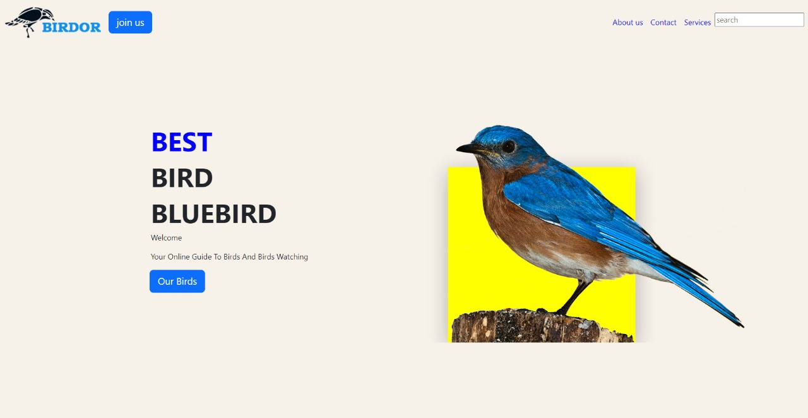

# Birdor 🐦

Birdor: Your Online Bird Watching Companion. Explore bird species &amp; habitats. Enhance your birding experience. For enthusiasts of all levels.
---

Website Link: [https://nehamaurya2311.github.io/Birdor/]

Welcome to the Birdor Website repository! This repository contains the code for a demo website built using Bootstrap, showcasing information about birds and bird watching.

## Preview 🖼

## Features ✨

- Responsive design using Bootstrap.
- Navbar with links to different sections: About Us, Contact, and Services.
- Search functionality.
- Eye-catching hero section with information about Bluebirds.
- Attractive design elements.

## Getting Started 🚀

To get a local copy up and running follow these simple steps:

1. Clone the repository:
   sh
   git clone https://github.com/NehaMaurya2311/Birdor.git
   
2. Open index.html in your preferred browser.

## Usage 🎨

Feel free to modify the code to suit your needs. Add more content, change styles, or extend functionalities as desired.

## Contributing 🤝

Contributions are what make the open-source community such an amazing place to learn, inspire, and create. Any contributions you make are *greatly appreciated*.

1. Fork the Project
2. Create your Feature Branch (git checkout -b feature/AmazingFeature)
3. Commit your Changes (git commit -m 'Add some AmazingFeature')
4. Push to the Branch (git push origin feature/AmazingFeature)
5. Open a Pull Request

## License 📝

Distributed under the MIT License. See LICENSE for more information.

## Acknowledgements 🙏

- Built with [Bootstrap](https://getbootstrap.com/)
- Icons from [Font Awesome](https://fontawesome.com/)

---
